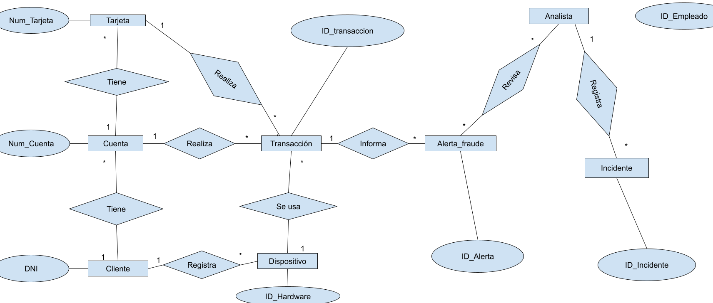
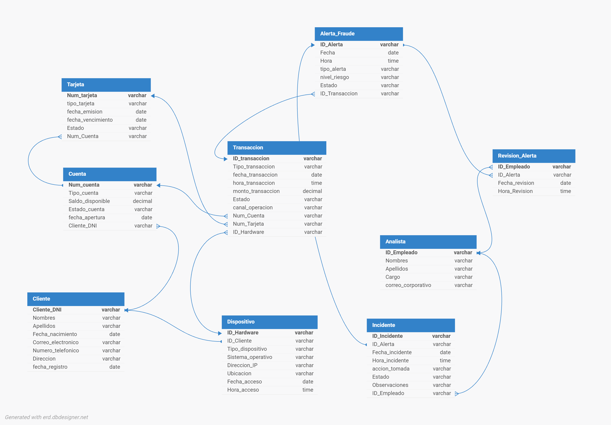

📊 CASO PROPUESTO
“Sistema de Detección de Fraude en Transacciones Bancarias” 🏦⚠️
📌 Contexto del negocio

El banco SecureBank Perú es una entidad financiera que ofrece servicios digitales como cuentas bancarias, transferencias, pagos en línea y tarjetas de débito y crédito. En los últimos años, el banco ha experimentado un incremento de operaciones fraudulentas, afectando la seguridad financiera de los clientes y la reputación de la entidad.

Actualmente, el monitoreo de transacciones sospechosas se realiza de manera parcial y mediante revisiones manuales, lo que dificulta detectar fraudes de forma rápida y eficiente.

Por ello, el banco ha decidido desarrollar un Sistema de Detección de Fraude en Transacciones Bancarias que permita:

Monitorear transacciones en tiempo real
Detectar operaciones sospechosas automáticamente
Generar alertas de posible fraude
Registrar incidentes y bloqueos preventivos
Analizar patrones de comportamiento de los clientes
🎯 Objetivo del sistema

Diseñar una base de datos que permita:

Registrar información completa de los clientes y sus cuentas bancarias
Gestionar transacciones financieras realizadas por los clientes
Detectar operaciones sospechosas según reglas de negocio
Registrar alertas e incidentes de fraude
Realizar seguimiento de casos fraudulentos
Generar indicadores para el análisis de riesgo y seguridad bancaria
🧩 Alcance funcional

El sistema debe contemplar las siguientes áreas:

👤 1. Gestión de Clientes

El banco maneja clientes que poseen productos financieros y realizan operaciones digitales.

De cada cliente se registra:

DNI
nombres y apellidos
fecha de nacimiento
correo electrónico
número telefónico
dirección
nivel de riesgo
fecha de registro

Un cliente puede tener múltiples cuentas bancarias y múltiples dispositivos asociados.

💳 2. Cuentas Bancarias y Tarjetas

Cada cliente puede poseer diferentes productos financieros:

cuenta de ahorros
cuenta corriente
tarjeta de débito
tarjeta de crédito

Cada cuenta registra:

número de cuenta
tipo de cuenta
saldo disponible
estado de la cuenta
fecha de apertura

Cada tarjeta registra:

número de tarjeta
tipo de tarjeta
fecha de vencimiento
estado
💸 3. Transacciones Bancarias

El sistema debe registrar todas las operaciones financieras realizadas por los clientes.

Tipos de transacción:

transferencias
pagos en línea
retiros
depósitos
compras con tarjeta

Cada transacción almacena:

fecha y hora
monto
tipo de transacción
ubicación
dispositivo utilizado
canal de operación (web, app móvil, cajero, POS)
estado de la transacción

Una cuenta puede generar múltiples transacciones.

📱 4. Dispositivos y Accesos

El sistema registra los dispositivos desde donde los clientes realizan operaciones.

Cada dispositivo almacena:

tipo de dispositivo
sistema operativo
dirección IP
ubicación aproximada
fecha de último acceso

Un cliente puede registrar múltiples dispositivos.

⚠️ 5. Detección de Fraude

El sistema debe identificar patrones sospechosos como:

múltiples intentos fallidos de acceso
transacciones de alto monto inusual
operaciones desde ubicaciones desconocidas
múltiples transacciones en corto tiempo
uso de dispositivos no reconocidos

Cuando se detecta una anomalía:

se genera una alerta de fraude
se clasifica el nivel de riesgo
se registra el motivo de la alerta
🚨 6. Alertas e Incidentes

Cada alerta generada registra:

fecha y hora
tipo de alerta
nivel de riesgo (bajo, medio, alto)
descripción
estado de la alerta

Las alertas pueden derivar en incidentes de fraude.

Cada incidente registra:

fecha del incidente
acción tomada
bloqueo temporal o permanente
observaciones
estado del caso
👨‍💼 7. Analistas de Seguridad

El banco cuenta con analistas encargados de revisar alertas e incidentes.

De cada analista se registra:

código de empleado
nombres y apellidos
cargo
correo corporativo

Un analista puede gestionar múltiples incidentes.
<!-- En tu README.md asegúrate de tenerlo así para que carguen correctamente: -->

